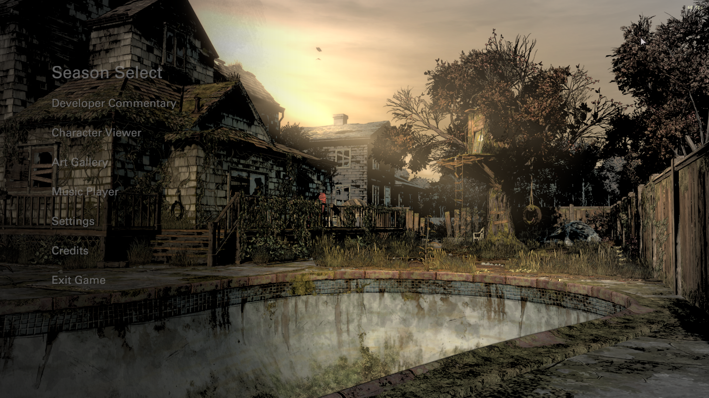
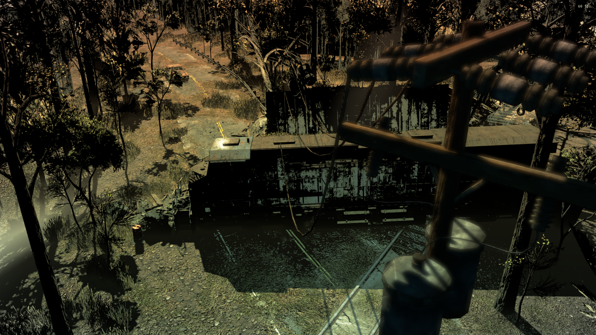
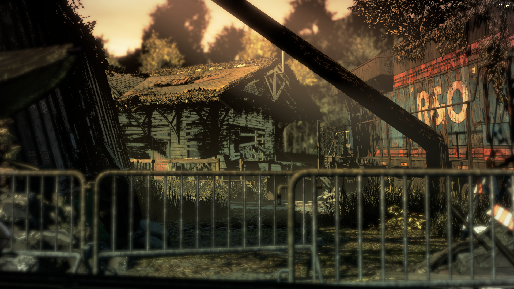
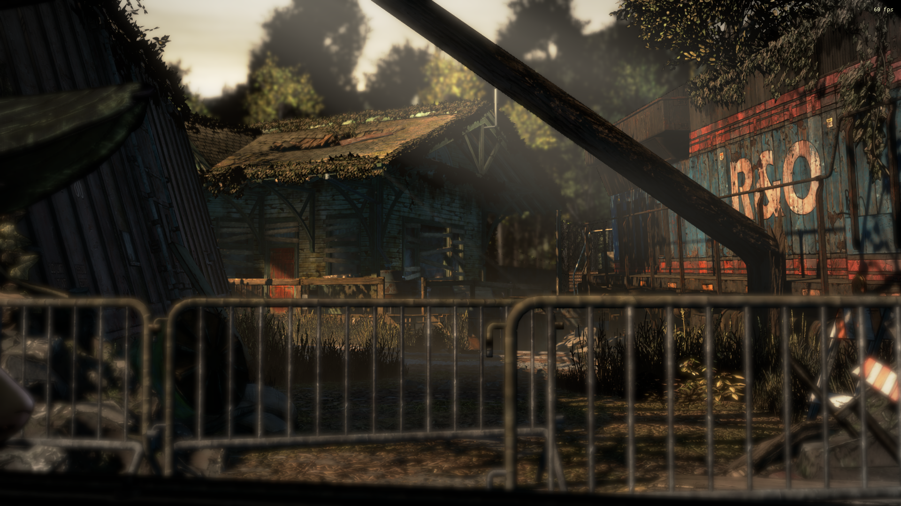

# Graphic Black Disabler for S4

### [Download the Mod here](https://github.com/changemymindpls/TTDS-GraphicBlackDisabler/releases)

### Install this mod using the [Telltale Mod Launcher](https://github.com/Telltale-Modding-Group/TelltaleModLauncher).

## DISCLAIMER

**This only works for 'The Walking Dead Telltale Definitive Edition'.**

## About

**This is Graphic Black Disabler mod for S4 (The Walking Dead Telltale Definitive Edition)**

In the Definitive Series there is a post effect introduced called Graphic Black, and it can be disabled in Season 1, Season 2, Season 3, and Michone, but it cannot be disabled in Season 4. This mod forcibly disables Graphic Black for Season 4, allowing true graphical uniformity across the games for those who wish to play without the post effect.

***Why disable Graphic Black?*** Graphic Black is incredibly destructive with its shadow details, turning pixels to pure black beyond a certain threshold in an attempt to emulate the inking used in comic books. Thereby eliminating any detail that can be perceived in the shadows. In addition, there is are additional color corrections that are applied that limit the overall color palette of the image, with the addition of an often-used green-brown graduated filter. When you disable graphic black, you allow the details in the shadows to be preserved once again, while eliminating the graduated filters, additional color correction, and the inking effect applied to the image, allowing it to appear more naturalistic once again in its dynamic range and color detail. ***Comparisons can be found if you scroll to the bottom of this document.***

**[Original Reddit Post](https://www.reddit.com/r/TheWalkingDeadGame/comments/hk795l/mod_twd_season_4_graphic_black_disabler/)**

## Download

**[Download the mod](https://github.com/changemymindpls/TTDS-GraphicBlackDisabler/releases)**

**This mod is compatible with the [Telltale Mod Launcher](https://github.com/Telltale-Modding-Group/TelltaleModLauncher) and can be installed using the tool.**

## Comparisons

**Enabled (Without Mod)**

**Disabled (With Mod)**

**Enabled (Without Mod)**

**Disabled (With Mod)**

**Enabled (Without Mod)**

**Disabled (With Mod)**

